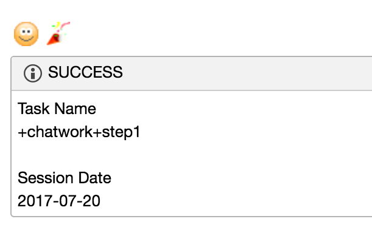
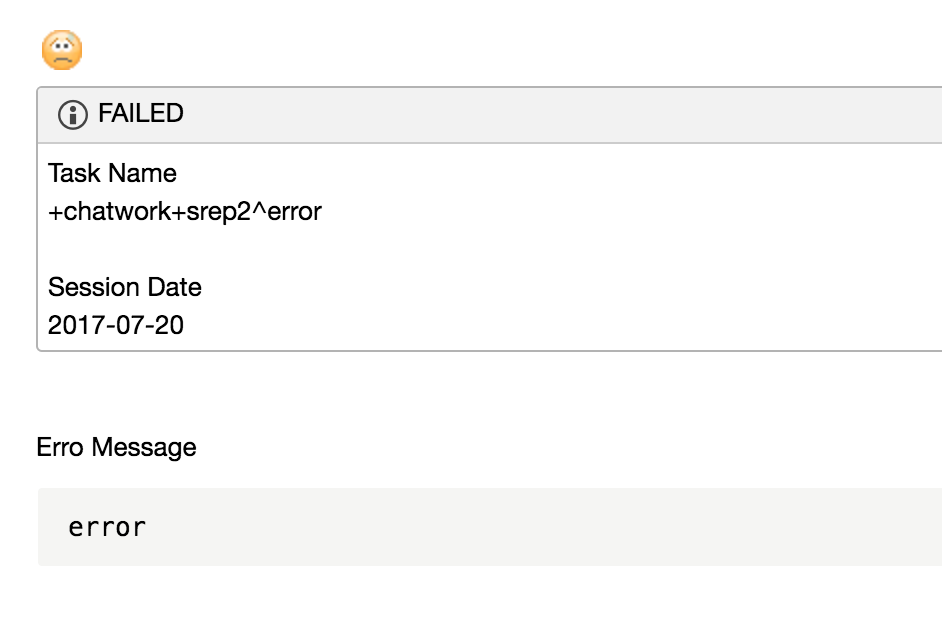

# digdag-chatwork
[](https://jitpack.io/#hizuki-aizawa/digdag-chatwork)
[](https://jitpack.io/#hizuki-aizawa/digdag-chatwork)

## Description
digdag-chatwork is a plugin sending messages to chatwork.  

reference
- [digdag-slack](https://github.com/szyn/digdag-slack)

***DEMO:***  

|SUCCESS|FAILED|
|---|---|
|[](sample/imgs/sample-good.png)|[](sample/imgs/sample-danger.png)|

## Features

- Can use the `chatwork>` opetaror
- Easy to use
- Flexible templates

## Requirement

- [Digdag](https://www.digdag.io/)


[Note]
If you want to use `task_name` variable, you must use digdag v0.9.9 and up.

## Usage
Also, you can see expamle workflow at [sample](https://github.com/hizuki-aizawa/digdag-chatwork/tree/master/sample) directory.

1. Create workflow file (e.g. chatwork.dig)

  ```yaml
  _export:
    plugin:
      repositories:
        - https://jitpack.io
      dependencies:
        - com.github.hizuki-aizawa:digdag-chatwork:0.1.0

    api_token: XXXXXXXXXXXXXXXX
    room_id: XXXXXXX

  +step1:
    chatwork>: good-template.txt
  ```

2. Create templates for chatwork's payload (e.g. good-template.txt)

  ```
  :)(cracker)
  [info][title]SUCCESS[/title]Task Name
  ${task_name}

  Session Date
  ${session_date}[/info]
  ```

3. Runs workflow
  ```console
  $ digdag run chatwork.dig
  ```

## License

[Apache License 2.0](LICENSE)
